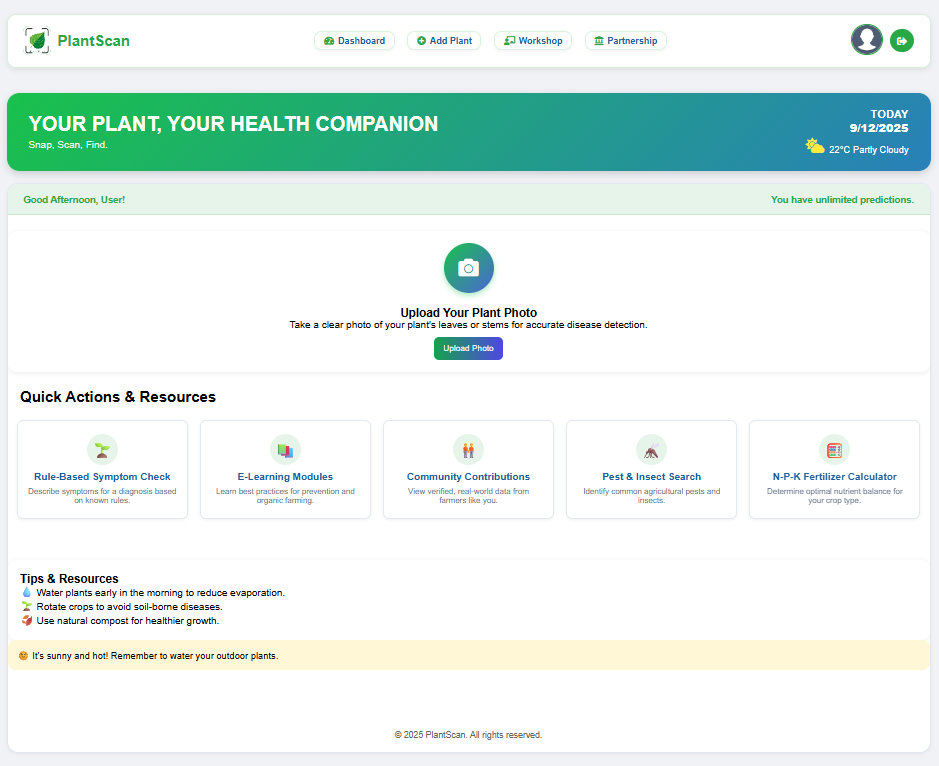
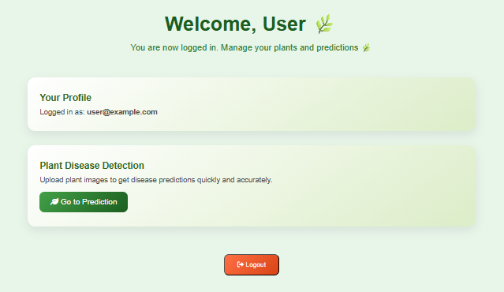
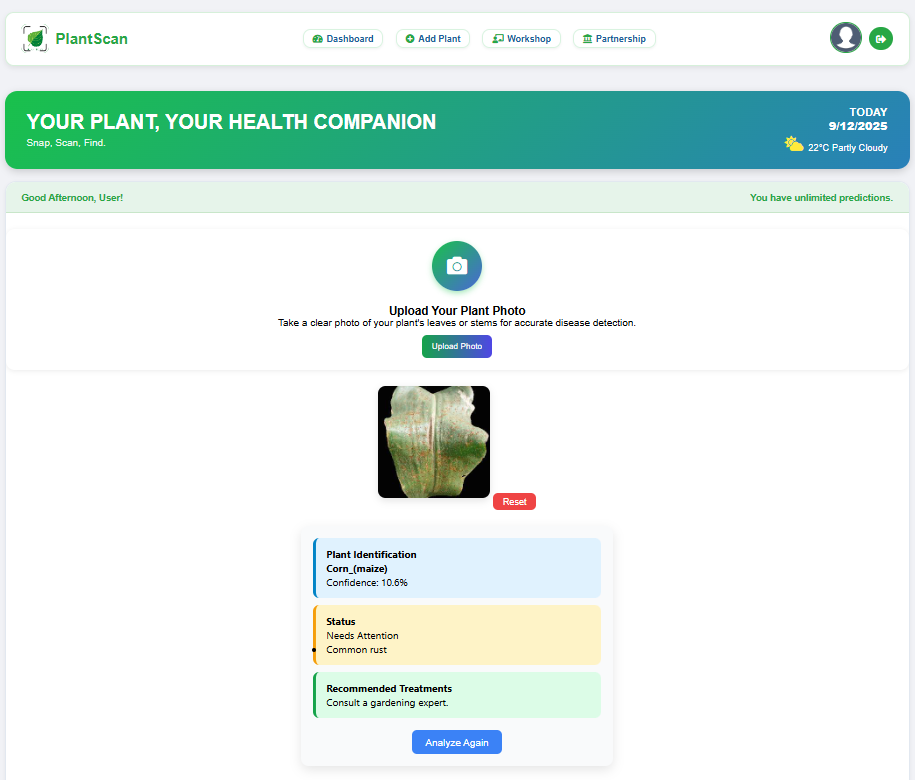
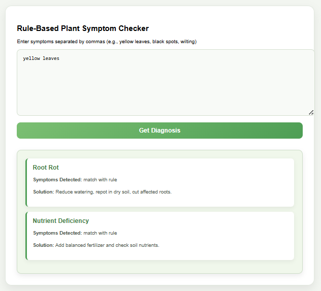
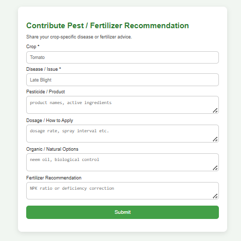
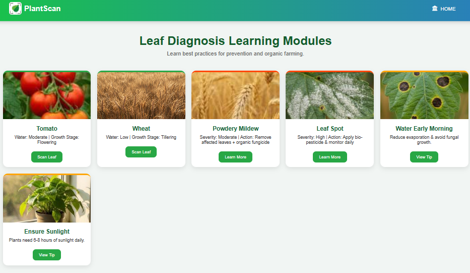
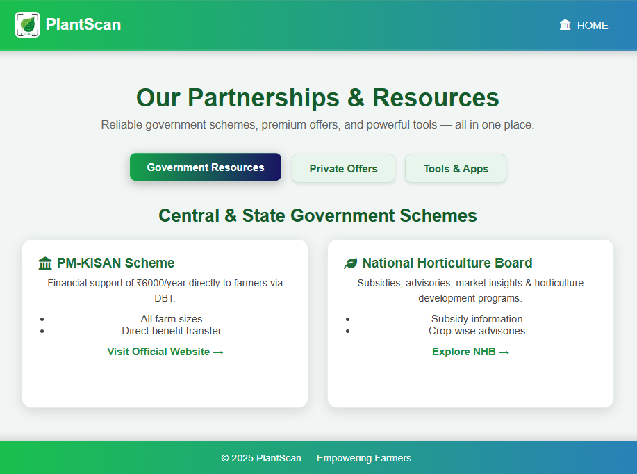
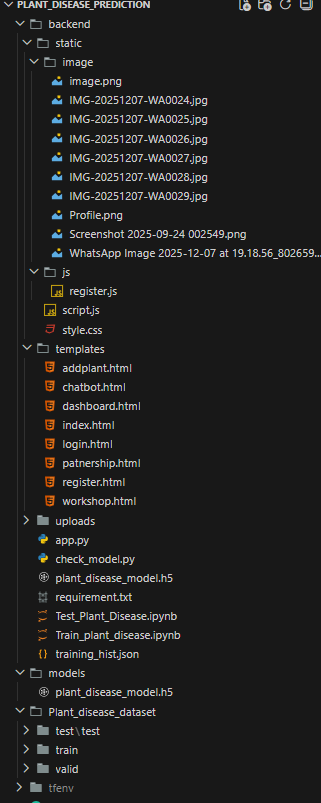

# 🌿 PlantScan - Smart Plant Disease Detection

PlantScan is an **AI-powered web application** that helps users detect plant diseases quickly and accurately. Snap, scan, and get real-time insights to keep your plants healthy!  

---

## 🚀 Features

- 🌱 **AI-Powered Detection:** Upload plant images or use the camera for live analysis  
- 🏥 **Health Status:** Identify diseases and get treatment suggestions  
- 📊 **Confidence Scores:** Know how confident the model is in predictions  
- 👩‍💻 **User Dashboard:** Personalized greetings, quick actions, and resource access  
- 🔄 **Reset & Analyze Again:** Try multiple images seamlessly  
- 🔒 **Secure Logout:** Clear session/localStorage for safety  
- 📚 **Educational Resources:** E-learning, community contributions, pest & fertilizer guides  

---

## 🛠 Technologies Used

| Frontend         | Backend       | AI/ML               | Others           |
|-----------------|---------------|-------------------|----------------|
| HTML, CSS, JS   | Python, Flask | TensorFlow/Keras   | Pillow, NumPy  |
| Font Awesome    | Jinja2        | Pre-trained Models | VS Code        |

---

## 🎯 Demo
**🏡 Home Screen**

**👤 Welcome Screen**

**🔬 Plant Disease Detection Prediction Result**

**📋 Rule-Based Plant Symptom Checker**

**💡 Contribute Pest / Fertilizer Recommendation**

**🌱 Leaf Diagnosis Learning Modules**

**🤝 Our Partnerships & Government Resources**

## 💻 Files

## 🧠 How to Run the Project (Step-by-Step)
Follow these instructions in **VS Code Terminal**:

### 1️⃣ Create & Activate Virtual Environment
📌 Notes :- RUN ALL THIS COMMAND IN POWERSHELL / BASH
Create environment:
python -m venv tfenv
Activate it:
▶ Windows
👉tfenv\Scripts\activate

2️⃣  Install all required dependencies
👉 pip install -r requirements.txt

3️⃣ Move into the backend folder
👉 cd backend

4️⃣ Run the Flask server
👉 python app.py

5️⃣ Open your project in the browser

if __name__ == "__main__":
    app.run(host='0.0.0.0', port=5000, debug=True)

 👉 * Running on all addresseshttp://127.0.0.1:5000
 👉 * Running on http://192.168.43.110:5000

PlantScan will start running! 🌱✨

**👩‍💻 Author**

Made with 💻 and ☘️ by **SHRUTI_BORDE**
